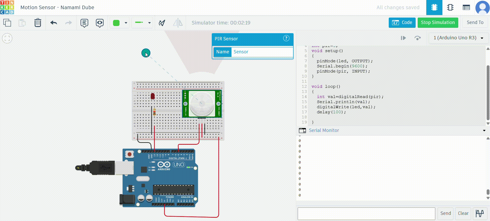
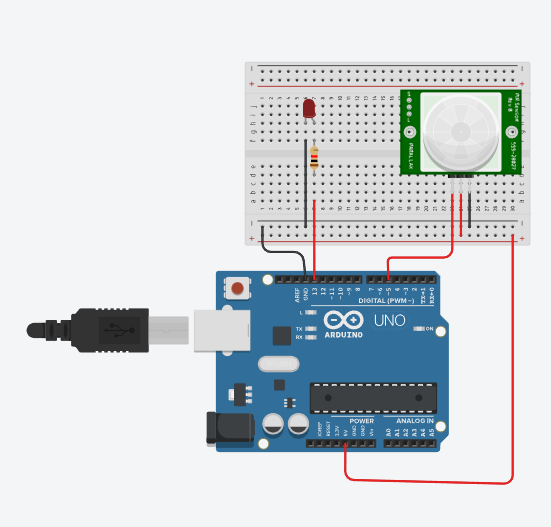

# Arduino Motion Sensor using PIR and LED

A simple Arduino project that uses a PIR motion sensor to detect motion and light up an LED. 

---
## Features

- Motion detection using PIR sensor
- LED turns on when motion is detected
- Serial monitor logs motion detection in real-time
---

## Demos

### Tinkercad Simulation (GIF)  

### Real Hardware Demo (GIF)  

### Try it Yourself on Tinkercad  
- [Click here to open Tinkercad Project](https://www.tinkercad.com/things/aZuyWDiViGe-motion-sensor-namami-dube?sharecode=5QIMezFv1R1gDsgsHPXaANsJW0f5UqNWj2HATQtAlGQ)

---

## Circuit Diagram

---

## Components Used

- Arduino Uno/Nano
- PIR Motion Sensor (HC-SR501)
- LED
- 220Ω Resistor (for LED)
- Jumper Wires
- Breadboard
- USB Cable for programming

---

## How to Run

1. **Build the circuit** as shown above.
2. **Upload the code** to Arduino using Arduino IDE.
3. **Open Serial Monitor** (set to 9600 baud).
4. Wave your hand in front of the sensor and watch the LED!

---

# Code File 
`motion_sensor.ino`

---

## Code Explanation

- `pinMode(led, OUTPUT)` — Sets the LED pin as output.
- `pinMode(pir, INPUT)` — Sets the PIR sensor pin as input.
- In the `loop()`, it reads the PIR sensor:
  - If motion is detected (`val = 1`), LED turns on.
  - If no motion is detected (`val = 0`), LED turns off.
- Serial monitor prints the motion value every second.

---
